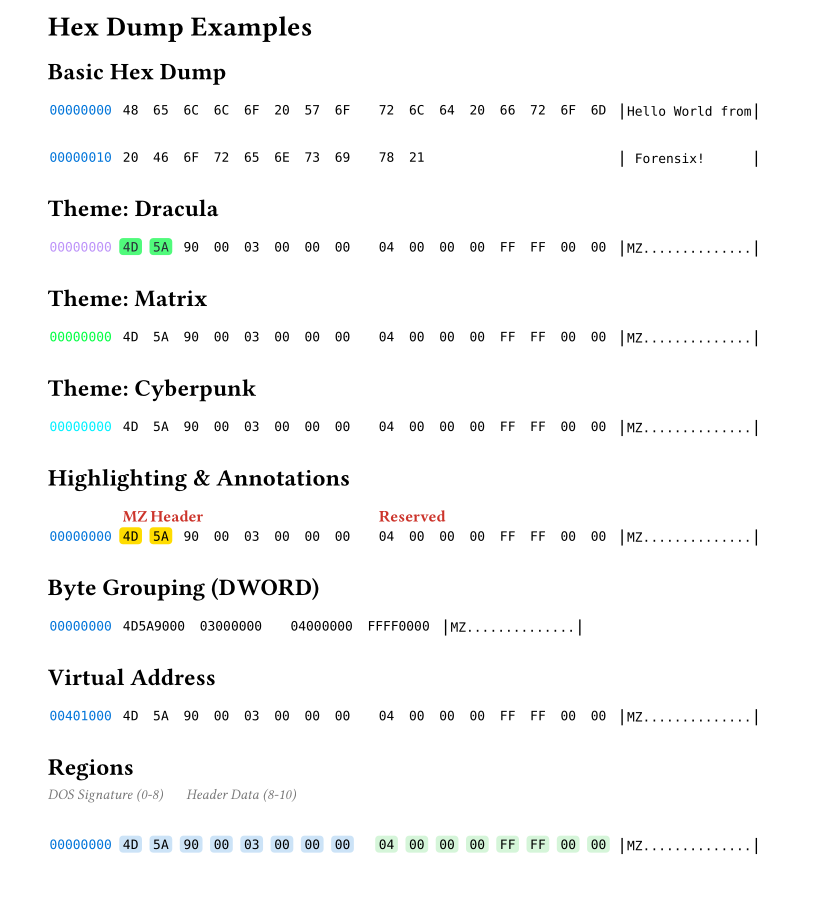

# Hex Dump

Professional hex dump visualization with the `hexdump -C` layout.

## Basic Usage

```typst
#import "@preview/forensix:0.1.0": hexdump

#hexdump(data: bytes)
#hexdump(file: "/path/to/file.bin")
```

## Parameters

| Parameter | Type | Default | Description |
|-----------|------|---------|-------------|
| `data` | bytes/array/str | none | Data to dump |
| `file` | string | none | Path to file to read |
| `columns` | int | 16 | Bytes per row (8 or 16) |
| `theme` | string | none | Color theme |
| `highlight` | array/dict | () | Byte values to highlight |
| `highlight-ranges` | array | () | Position ranges to highlight |
| `annotations` | dict | (:) | Offset annotations |
| `print-ranges` | array | () | Partial printing ranges |
| `base-address` | int | 0 | Base address offset |
| `address-width` | int | 8 | Hex digits for offset |
| `group-bytes` | int | 1 | Bytes per group (1, 2, 4) |
| `regions` | array | () | Named regions with labels |
| `show-connectors` | bool | false | Annotation connector lines |

## Themes

Available themes: `light`, `dark`, `dracula`, `matrix`, `monokai`, `nord`, `cyberpunk`, `gruvbox`

```typst
#hexdump(file: "malware.bin", theme: "dracula")
```

## Highlighting

```typst
// By byte value
#hexdump(data: bytes, highlight: (0x4d, 0x5a, 0x90))

// With custom colors
#hexdump(data: bytes, highlight: (
  "0x4d": blue,
  "0x5a": green,
))

// By position range
#hexdump(data: bytes, highlight-ranges: (
  (start: 0, end: 16, color: yellow),
  (start: 64, end: 80, color: orange),
))
```

## Annotations

```typst
#hexdump(
  data: shellcode,
  annotations: (
    "0": "Entry Point",
    "16": (text: "Payload", color: red),
    "0x20": "String Data",
  ),
)
```

## Partial Printing

```typst
#hexdump(
  file: "large_file.bin",
  print-ranges: (
    (start: 0, end: 64),      // First 64 bytes
    (start: 1024, end: 1088), // Offset 1024
  ),
)
// Renders [...] separator between ranges
```

## Byte Grouping

```typst
#hexdump(data: bytes, group-bytes: 2)  // WORD
#hexdump(data: bytes, group-bytes: 4)  // DWORD
```

## Regions

```typst
#hexdump(
  data: pe_header,
  regions: (
    (start: 0, end: 64, label: "DOS Header", color: blue.lighten(80%)),
    (start: 64, end: 128, label: "PE Header", color: green.lighten(80%)),
  ),
)
```

## Virtual Addresses

```typst
#hexdump(
  data: memory_dump,
  base-address: 0x00401000,
  address-width: 8,
)
```


## Example

