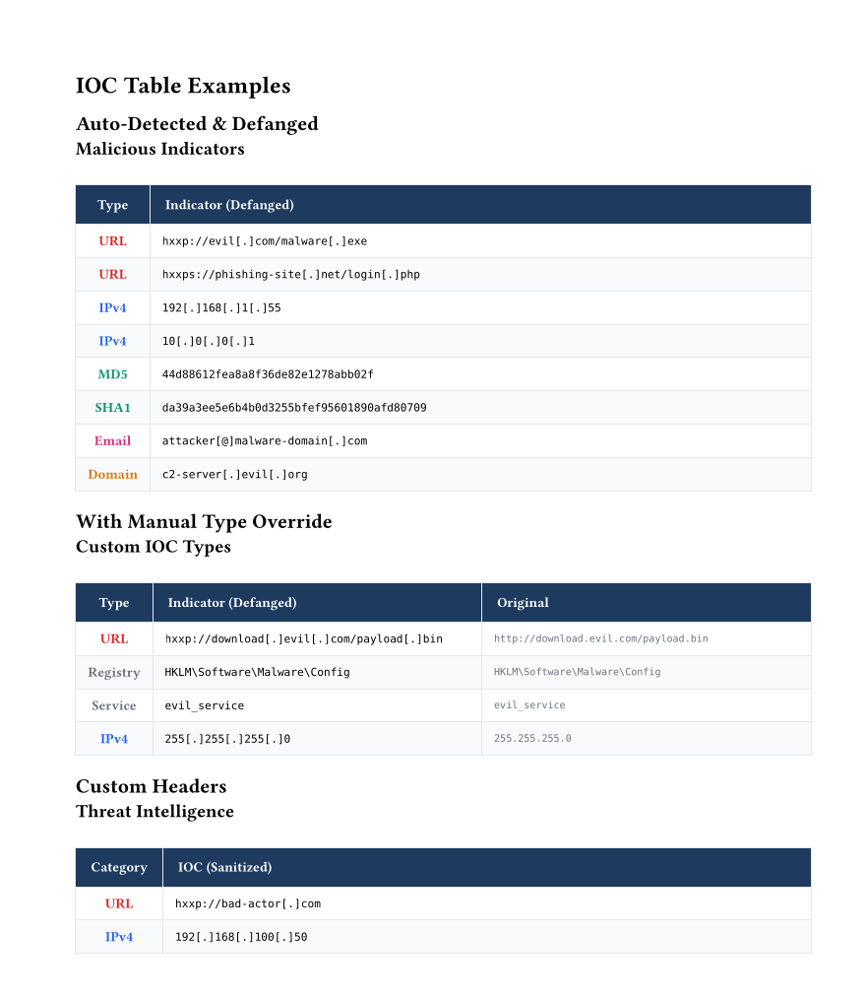

# IOC Table

Auto-defanging table for Indicators of Compromise (IOCs) with automatic type detection.

## Basic Usage

```typst
#import "@preview/forensix:0.1.0": ioc-table, ioc

#ioc-table(
  indicators: (
    "http://evil.com/malware.exe",
    "192.168.1.55",
    "44d88612fea8a8f36de82e1278abb02f",
  ),
)
```

## Parameters

| Parameter | Type | Default | Description |
|-----------|------|---------|-------------|
| `title` | string | none | Table title |
| `indicators` | array | () | Array of IOC strings or dicts |
| `show-original` | bool | false | Show original unfanged value |
| `type-header` | string | "Type" | Column header for type |
| `indicator-header` | string | "Indicator (Defanged)" | Column header for value |
| `original-header` | string | "Original" | Column header for original |
| `style` | dict | (:) | Custom styling |

## Auto-Defanging

All indicators are automatically defanged at render time:

| Original | Defanged |
|----------|----------|
| `http://` | `hxxp://` |
| `https://` | `hxxps://` |
| `ftp://` | `fxp://` |
| `.` | `[.]` |
| `@` | `[@]` |

## Auto-Detection

Types are automatically detected:

| Type | Pattern |
|------|---------|
| URL | Starts with `http://`, `https://`, `ftp://` |
| IPv4 | Four dot-separated number groups |
| IPv6 | Contains `::` or multiple `:` |
| Email | Contains `@` and `.` |
| MD5 | 32 hex characters |
| SHA1 | 40 hex characters |
| SHA256 | 64 hex characters |
| SHA512 | 128 hex characters |
| Domain | Contains `.`, no protocol |

## Manual Type Override

Use the `ioc()` helper for custom types:

```typst
#ioc-table(
  indicators: (
    "http://evil.com",           // Auto: URL
    "192.168.1.1",               // Auto: IPv4
    ioc("HKLM\\Software\\Bad", type: "Registry"),  // Manual
    ioc("custom-value", type: "Custom Type"),
  ),
)
```

## Show Original Values

Compare defanged vs original:

```typst
#ioc-table(
  indicators: (...),
  show-original: true,
)
```

## Custom Column Headers

```typst
#ioc-table(
  indicators: (...),
  type-header: "Category",
  indicator-header: "IOC (Safe)",
  original-header: "Raw Value",
)
```

## Type Colors

Each type has a distinct color:

- **URL**: Red
- **IPv4/IPv6**: Blue/Purple
- **Hashes**: Green
- **Domain**: Orange
- **Email**: Pink
- **Unknown**: Gray

Colors can be customized via the `style` parameter.


## Example


