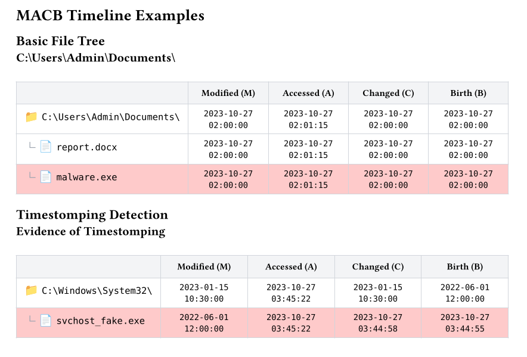

# MACB Timeline

File tree visualization with MACB (Modified, Accessed, Changed, Birth) timestamps for forensic analysis.

## Basic Usage

```typst
#import "@preview/forensix:0.1.0": macb-timeline, file-entry, folder-entry

#macb-timeline(
  title: "Suspicious Directory",
  entries: (
    folder-entry("C:\\Users\\Admin\\", depth: 0, ...),
    file-entry("malware.exe", depth: 1, ...),
  ),
)
```

## Parameters

### macb-timeline

| Parameter | Type | Default | Description |
|-----------|------|---------|-------------|
| `title` | string | none | Table title |
| `entries` | array | () | Array of file/folder entries |
| `style` | dict | (:) | Custom styling |

### file-entry / folder-entry

| Parameter | Type | Default | Description |
|-----------|------|---------|-------------|
| `name` | string | required | File/folder name |
| `depth` | int | 0 | Indentation level |
| `type` | string | "file" | "file" or "folder" |
| `modified` | string | none | Modified timestamp (M) |
| `accessed` | string | none | Accessed timestamp (A) |
| `changed` | string | none | Changed timestamp (C) |
| `birth` | string | none | Birth timestamp (B) |
| `highlight` | color | none | Row highlight color |

## Timestamp Format

Use `"YYYY-MM-DD HH:MM:SS"` format:

```typst
modified: "2023-10-27 02:00:00",
accessed: "2023-10-27 02:01:15",
changed: "2023-10-27 02:00:00",
birth: "2023-10-27 02:00:00",
```

## Anomaly Highlighting

Highlight suspicious files with a background color:

```typst
file-entry(
  "svchost_fake.exe",
  depth: 1,
  modified: "2022-06-01 12:00:00",  // Fake old date
  changed: "2023-10-27 03:44:58",   // Recent MFT change!
  birth: "2023-10-27 03:44:55",     // Actually created recently
  highlight: rgb("#fecaca"),        // Red highlight
)
```

## Timestomping Detection

The key to detecting timestomping is comparing the M (Modified) timestamp with the C (Changed/MFT) timestamp. If M shows an old date but C shows a recent date, the file was likely timestomped.

```typst
#macb-timeline(
  title: "Evidence of Timestomping",
  entries: (
    file-entry(
      "suspicious.exe",
      depth: 0,
      modified: "2020-01-01 00:00:00",  // Impossibly old
      accessed: "2023-10-27 03:45:22",
      changed: "2023-10-27 03:44:58",   // Reveals true time!
      birth: "2023-10-27 03:44:55",
      highlight: rgb("#fecaca"),
    ),
  ),
)
```

## Tree Structure

The `depth` parameter controls indentation and tree connectors:

```typst
folder-entry("C:\\", depth: 0, ...),         // Root
folder-entry("Windows\\", depth: 1, ...),    // ├ Child
file-entry("explorer.exe", depth: 2, ...),   // │ └ Grandchild
folder-entry("Users\\", depth: 1, ...),      // └ Sibling
```

## Example

