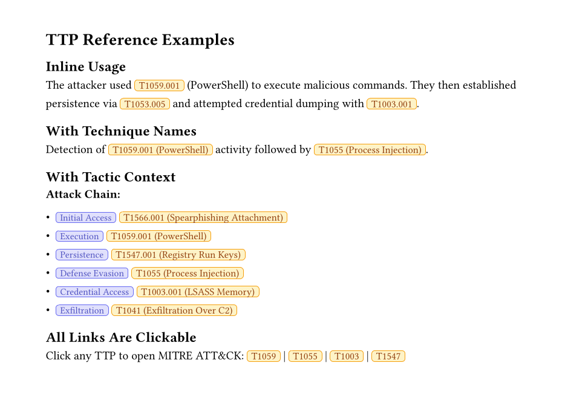

# TTP References

Inline MITRE ATT&CK technique references with clickable links.

## Basic Usage

```typst
#import "@preview/forensix:0.1.0": ttp, ttp-full

The attacker used #ttp("T1059.001") to execute commands.
```

## Parameters

### ttp

| Parameter | Type | Default | Description |
|-----------|------|---------|-------------|
| `id` | string | required | Technique ID (e.g., "T1059.001") |
| `name` | string | none | Technique name |
| `show-name` | bool | false | Show name inline |
| `style` | dict | (:) | Custom styling |

### ttp-full

| Parameter | Type | Default | Description |
|-----------|------|---------|-------------|
| `id` | string | required | Technique ID |
| `tactic` | string | none | Tactic name (e.g., "Execution") |
| `name` | string | none | Technique name |
| `style` | dict | (:) | Custom styling |

## Inline Cards

Simple technique reference:

```typst
The malware uses #ttp("T1059.001") for execution.
```

Renders as a styled badge: `[T1059.001]`

## With Technique Name

```typst
#ttp("T1059.001", name: "PowerShell", show-name: true)
```

Renders: `[T1059.001 (PowerShell)]`

## With Tactic Context

```typst
#ttp-full("T1566.001", tactic: "Initial Access", name: "Spearphishing Attachment")
```

Renders: `[Initial Access] [T1566.001 (Spearphishing Attachment)]`

## Clickable Links

All TTP references automatically link to their MITRE ATT&CK definition:

- `T1059.001` → https://attack.mitre.org/techniques/T1059/001/
- `T1055` → https://attack.mitre.org/techniques/T1055/

## Attack Chain Documentation

```typst
The attack progressed through:

1. #ttp-full("T1566.001", tactic: "Initial Access")
2. #ttp-full("T1059.001", tactic: "Execution")
3. #ttp-full("T1547.001", tactic: "Persistence")
4. #ttp-full("T1003.001", tactic: "Credential Access")
5. #ttp-full("T1041", tactic: "Exfiltration")
```

## Custom Styling

```typst
#ttp("T1059.001", style: (
  bg: rgb("#fee2e2"),
  border: rgb("#dc2626"),
  text: rgb("#991b1b"),
))
```

## Example



